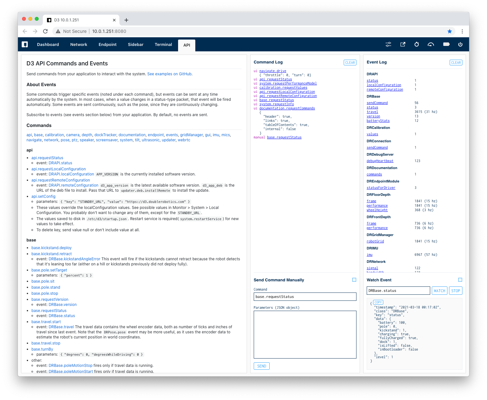

# Communicating with the on-board D3 service

The core D3 software runs as a system service called `d3`. Your code will interact with this service by [sending commands and receiving events](API.md).

### IPC via Unix domain socket

All commands and events are sent over a standard [Unix domain socket](https://en.wikipedia.org/wiki/Unix_domain_socket). It is a `SOCK_STREAM` TCP type. There are no synchronous commands.

The socket is located at `/tmp/doubleapi`.

All commands and events are sent in [strict JSON format](https://www.w3schools.com/js/js_json_syntax.asp) and must be separated by a new line character (`\n`, ASCII code 10).

## Command Structure

A command packet is sent from your application to the d3 service. Each packet must contain a command property (`c`), which must be a string and, depending on the command, may include a data property (`d`) that must be an object containing the properties listed in the [API documentation](API.md).

Example command (pretty printed):

    {
      "c": "base.pole.setTarget",
      "d": {
        "percent": 0.5
      }
    }

Send to the socket:

    {"c":"base.pole.setTarget","d":{"percent":0.5}}

## Event Structure

[Events](API.md#events-1) are sent from the d3 service to your application. You will receive only the events that you have subscribed to (see below). These may be sent immediate after a command requests certain data, may be a frequently sent stream of data, like the IMU data, or they may be sent automatically based on changes in data (like the robot base's battery level). 

All event packets include three string properties: `timestamp` in UTC time, `class` (indicating where it's coming from), and `key` (the specific type of packet). Some packets will also include a `data` property.

Events can be uniquely identified by combining the `class` and `key` properties, which we generally write in dot syntax style, like `DRPose.pose`.

Example event:

    {
      "timestamp": "2020-04-29 17:59:57",
      "class": "DRIMU",
      "key": "imu",
      "data": {
        "converged": true,
        "quat": {
          "x": 0.4955,
          "y": -0.0323,
          "z": -0.0204,
          "w": 0.503
        }
      }
    }

As received by your application from the socket:

    {"timestamp":"2020-04-29 17:59:57","class":"DRIMU","key":"imu","data":{"converged":true,"quat":{"x":0.4955,"y":-0.0323,"z":-0.0204,"w":0.503}}}

## Subscribe to Events

You will receive only events that you subscribe to. The general pattern is to subscribe to events right after connecting to the socket. The subscriptions last until your socket connection is closed or you specifically unsubscribe from them. Use the `events.subscribe` command to subscribe and `events.unsubscribe` to unsubscribe. It is not necessary to unsubscribe before closing your connection to the socket.

Example:

    {
      "c": "events.subscribe",
      "d": {
        "events": [
          "DRAPI.status",
          "DRBase.status",
          "DRIMU.imu"
        ]
      }
    }

Subscribing to all events is possible by passing `*` as an entry in the `events` array, but not recommended, since it's a lot of data.

## Special Connection from JavaScript

When running a custom standby screen or opening an accessory web view in "trusted" mode, a global object is injected by the Electron container called `DRDoubleSDK`. This is a simple object that passes commands and events through to the socket. See the [standby-basic example](../examples/standby-basic/) for how to use this.

## Basic Command Line Test

You can connect to the socket with netcat:

    nc -U /tmp/doubleapi

Then type a command and press enter:

    {"c":"base.pole.stand"}

## Connect via Network (insecure)

On D3:

    sudo apt-get install socat
    socat TCP-LISTEN:22022 UNIX-CONNECT:/tmp/doubleapi

On another device:

    nc YOUR_D3_IP 22022

or connect with a TCP socket from any programming language of your choice.

## API Explorer

The Developer Monitor's API tab is an interactive explorer for testing and discovering commands and events. Click the links to fill the Send Command and Watch Event widgets. The logs show you exactly what's happening when you click buttons in the user interface. The Monitor automatically subscribes to all events, so you can discover events that are available to you.

