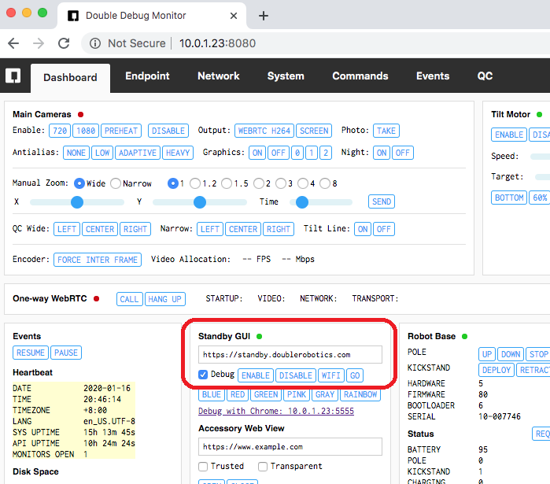

# Basic Standby Screen

Before accessing any developer features, your Double 3 will need to be [put into developer mode](../../docs/Developer%20Mode.md).

This page explains how to display a custom, interactive screen on your Double 3's touchscreen using HTML and Javascript.

Open the Developer Monitor of your D3 in Chrome on your computer by visiting: ````http://YOUR_D3_IP:8080````. You can find your D3's local IP by tapping the WiFi icon on the default standby screen.

## Host Your Files

Upload your files to a web server or launch a web server on your local computer. You can do that easily in a terminal by changing to this repository directory and [running a static web server](https://gist.github.com/willurd/5720255), such as:

python 2:

    python -m SimpleHTTPServer 8000

or python 3:

    python -m http.server 8000

Type the address of your web server (````http://YOUR_COMPUTER_IP:8000/````) into the Standby GUI input field and click the "Go" button.



## Chrome DevTools

In order to easily debug your web application as it runs on your D3, you can open the Chrome DevTools on your local machine and debug it remotely.  To do this, first mark the Debug checkbox on the Debug Monitor, then Disable and re-Enable the Standby GUI. Now, in the Standby GUI section of your Debug Monitor, a link will appear, which will look something like: ````http://YOUR_D3_IP:5555````.  Click the link to open the Chrome DevTools on your local machine.  

### DevTools Screencast Bug

There is a bug in Chrome DevTools while the "screencast" feature is on (the default). Rendering on the remote device (D3 screen) sometimes does not update. We recommend turning off the screencast - click the phone/tablet devices icon. You can still refresh your target page by using the key command (i.e. cmd + R).

### Launching Your Standby Screen on Startup

In order to make your new standby screen launch when your D3 starts up, you will need to [modify the startup.json](../../docs/Startup.md).  SSH into your D3 and edit the file `/etc/d3/startup.json`.  Add the property called STANDBY_URL in the "config" section, with a value containing the URL of your standby screen.

    {
       "config":{
          "STANDBY_URL": "http://YOUR-PAGE.com/"
       },
       "commands":[
          { "c": "events.server.enable" },
          { "c": "gui.enable" },
          { "c": "screensaver.allow" },
          { "c": "network.requestLocation" },
          { "c": "endpoint.enable", "delayMs": 2000 }
       ]
    }
